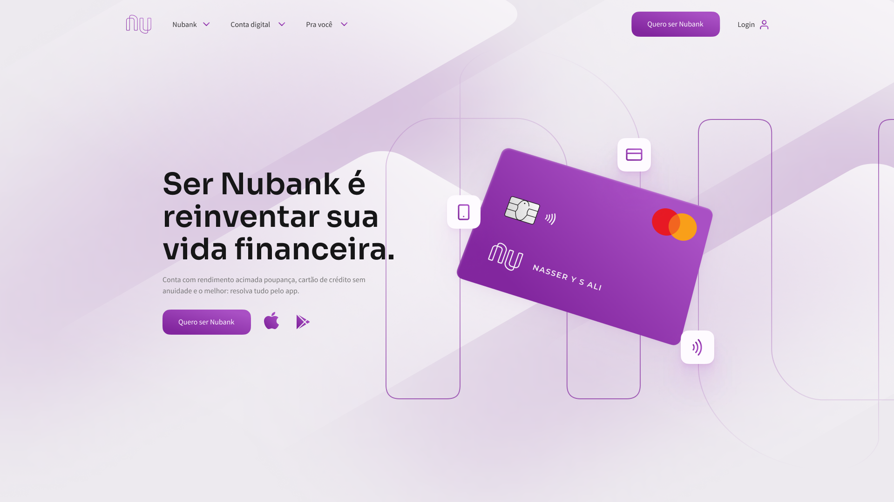

<h1 align="center">
    Project Nubank
    <br>
</h1>
<h1 align="center">
    
    <br>
</h1>

<h4 align="center">
  <p>Nubank</p>
  
  <p>This application was developed during the FrontPush from Nasser Yousef.</p>

  <p>
  Implementation of an alternative version of Nubank
  In this project we built an awesome landing page from the beginning. 
  We started by creating the UI Design of aplicaton. And finally we developed the page using HTML, SASS and Javascript
  </p>
</h4>

<div>
    
</div>

## How to use

1. Install Visual Studio Code 

   Voce deve instalar o [VsCode](https://code.visualstudio.com/) para conseguir executar o site.

1. Clone this repository

   Click on terminal in the top left corner and then on New terminal and type in terminal

   ```bash
   # Clone this repository
   $ git clone https://github.com/Breno1210/Project-Nubank.git

   # Go into the repository
   $ cd Project-Nubank
   ```

2. Install the extension Live Server

    Click on the Extensions option and then search for Live Server and click on install.

    After installing, click on the Go Live option on the bottom right.

    In this way, you can go to your preferred browser and type the url `http://localhost:3000` that the application will be at that address.


<h1 align="center">
    UI-Final
    <br>
</h1>
<h1 align="center">
    
</h1>

## ✒️ Author

- [@Breno1210](https://github.com/Breno1210)
- Teacher [Násser Yousef Ali](https://github.com/nyousefali)

---